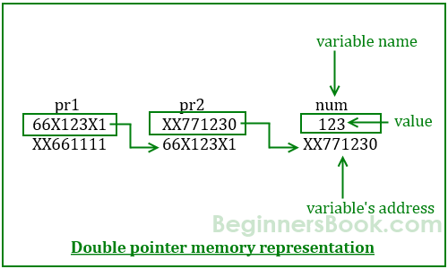

# double pointer

## Why use it?

If a function foo() is going to modify not only the value which the argument pointer is pointing at, but also the value of the argument pointer itself, we must not pass the pointer to the argument but pass the address of the pointer &p. This can be represented as mytype** pointer.

For example, the `void swap(int *a, int *b)` function uses pointers in order to modify the values (or *a, *b) the pointers are pointing at, not the pointers (or a, b) themselves. On the other hand, `void insertList(linkedList **`

