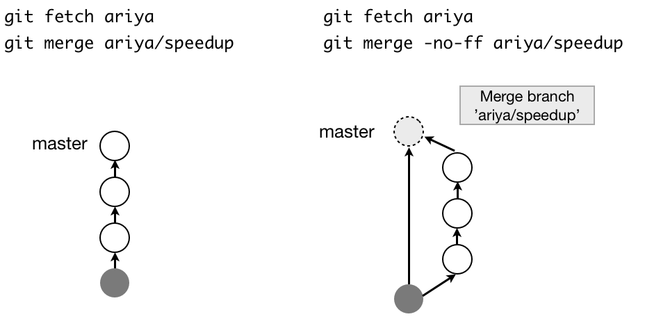

# Git branch

## Check existing branches
`$ git branch`

## normal workflow
* create branch `git branch develop` from master branch
* The new branch would resemble the branch where the above command was typed in. If new branch is created from develop branch, then the new branch would have files that develop branch has, not the files of master branch.
* checkout to the new branch created.
    `$ git checkout develop`
    The above two commands can be simplified as following:
    `$ git checkout -b develop`
* If merge needed, checkout to the directory you would like to retain, then use `git merge`.
    `$ git checkout master`
    `$ git merge develop`

## how to delete a branch?
After ensuring that the data is all pushed,
`$ git branch -d develop`

## What is fast forward?
Let us say I created a branch named git 'develop' from 'master'.
Leaving 'master' unchanged, I made a few progress in 'develop' branch and would like to push to my remote.
The project maintainer would type the following commands:
```
git fetch dqgt
git merge dqgt/develop
```
What happens here is that git would simply make point the master branch to my latest commit in 'develop' branch, resulting linear commit history.

If `--no-ff` option is enabled, a new commit is created.
[This post](https://ariya.io/2013/09/fast-forward-git-merge) was helpful.




In order to disable ff by default,
```
git config branch.master.mergeoptions "--no-ff"
```


